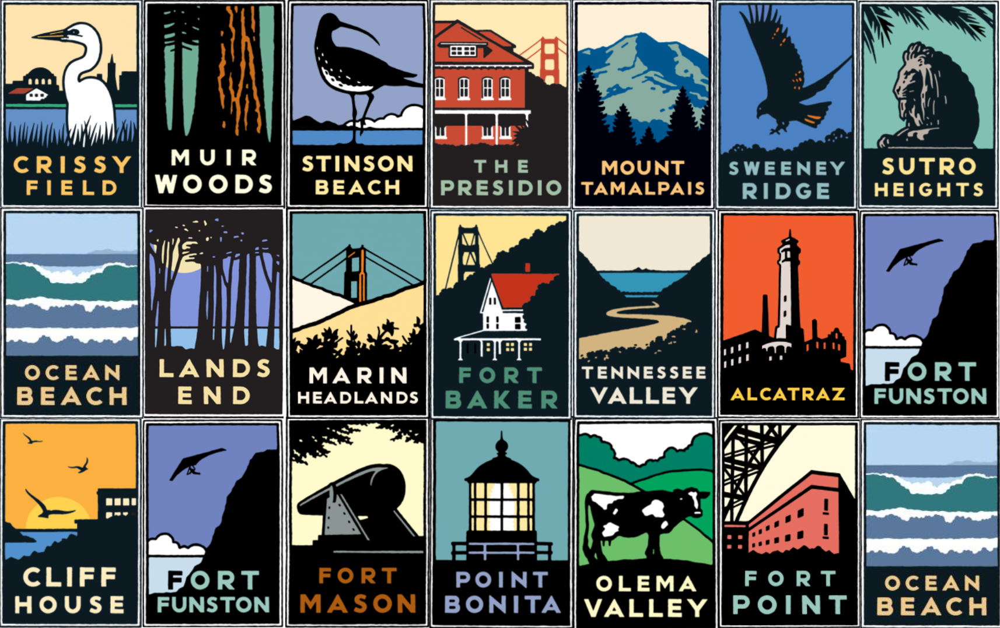

# Golden Gate National Parks Conservancy - Membership Strategy Project 🌉🌲




## Overview

This project was completed in collaboration with the **Golden Gate National Parks Conservancy** as part of a pro bono engagement through Catchafire. The focus of this work was to evaluate, analyze, and provide strategic recommendations for improving their **membership program** — a key revenue and engagement driver that supports vital park stewardship efforts across the Bay Area.

The core output of this project includes:
- A **comprehensive analysis deck** with peer benchmarking, SWOT analysis, and membership insights
- An **interactive dashboard** for exploring membership trends by category and time
- A **proposed set of refined membership tiers and benefits**
- A **strategy document** outlining key opportunities, campaign ideas, and growth tactics

## 🔍 Background

Golden Gate National Parks Conservancy is a nonprofit organization that supports park stewardship, environmental education, and public engagement across 37 iconic park sites in the San Francisco Bay Area. With ~9,000 active member households, the organization wanted to scale its base and refresh its offerings to better engage new audiences.

## 🎯 Project Goals

- Identify growth challenges within the current membership program
- Benchmark successful practices from peer organizations (e.g. Surfrider, National Park Foundation)
- Propose refined membership tiers and updated value propositions
- Visualize historical membership revenue trends and category performance
- Recommend digital-first and community-based campaign strategies

## 🛠️ Deliverables

- **Presentation Slide Deck**: A structured walkthrough of research, findings, and recommendations
- **Evaluation Plan**: High-level outcomes framework tied to membership success metrics
- **SWOT Analysis**: Strengths, Weaknesses, Opportunities, Threats of the current membership program
- **Peer Org Matrix**: Summary of six leading park and environmental organizations’ strategies
- **Prototype Membership Tiers**: Suggested tiering system optimized for engagement and sustainability
- **Interactive Dashboard**: [View Demo](https://sathwikkes.github.io/GGNPC-Membership/)

## 🔄 Workflow

1. **Discovery Phase**
   - Reviewed existing GGNPC data (membership tiers, benefits, join dates, expiration trends)
   - Researched peer nonprofit strategies for member engagement and growth

2. **Data Analysis**
   - Cleaned and analyzed membership data using Tableau [View Story Points](https://public.tableau.com/views/Golden-Gate-National-Parks-Conservancy-Member-Analysis/Story1?:language=en-US&:sid=&:redirect=auth&:display_count=n&:origin=viz_share_link)
   - Created calculated fields (e.g., “Renewal Status”) to identify expiring/expired members
   - Segmented members by category, join year, and household demographics

3. **Strategic Review**
   - Created a SWOT analysis of the current program
   - Profiled key peer organizations and extracted best practices
   - Assessed gaps in benefit appeal, marketing, and data infrastructure

4. **Prototype Development**
   - Drafted new membership tiers using the MoSCoW framework
   - Designed supporting visuals and messaging strategies in Canva

5. **Dashboard Build**
   - Deployed an interactive web-based dashboard using HTML + Tableau Public
   - Enabled stakeholders to view revenue trends by tier and timeframe

6. **Final Recommendations**
   - Shared specific growth strategies across influencer outreach, member retention, and digital marketing
   - Highlighted the importance of streamlining communications and improving first-year onboarding

## 📊 Key Findings

- 87% of active members live in the Bay Area, yet younger and more diverse audiences are underrepresented
- Over 80% are aware of their benefits, but only 30% find them motivating
- January, May, and December are peak acquisition months
- Retail membership acquisition shows lower retention than online or direct mail channels
- Gaps in system integration are limiting personalized communication

## 💡 Strategic Recommendations

- Refresh benefit offerings and tier language to inspire engagement and clarity
- Partner with micro-influencers and nature-focused creators to raise awareness
- Host more local events and pop-ups at community outdoor gatherings (e.g. SF Marathon)
- Invest in digital onboarding and retention tools (e.g. auto-renew reminders, monthly giving)
- Align campaigns with youth and education programming (e.g. “Adopt-a-Park” for classrooms)

## 📁 File Structure

```bash
📦GGNPC-Membership
 ┣ 📂assets
 ┣ src
 ┣ 📄README.md
 ┣ 📄program-review-document.pdf
 ┣ 📄slide-deck.pdf
```
##  🙌 Acknowledgements
- Huge thanks to Mindee, my project lead and volunteer manager, for the guidance, enthusiasm, and trust throughout this process.
- Shoutout to Catchafire for enabling these meaningful collaborations between nonprofits and skilled volunteers.